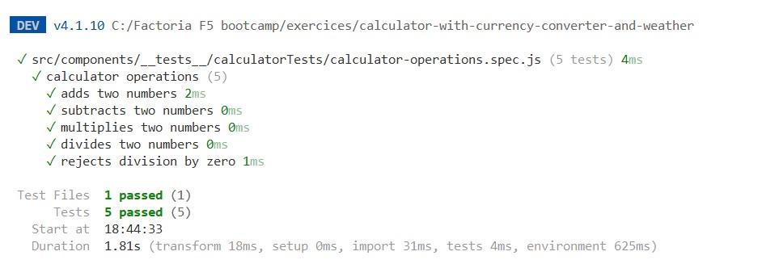
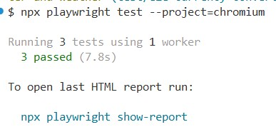
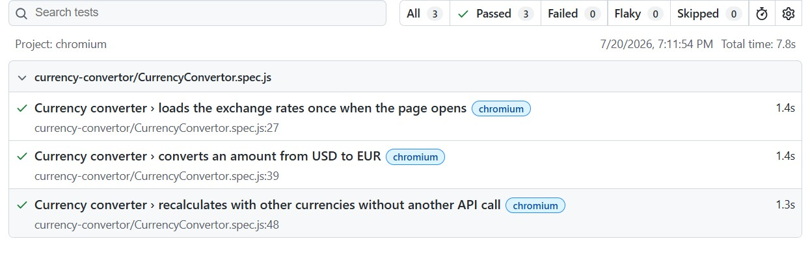

# Calculator with Currency Converter and Weather

## Objective

Create a multifunctional calculator built with Vue.

## Minimum requirements for the calculator

The calculator must support the basic arithmetic operations:

- Addition
- Subtraction
- Multiplication
- Division

Required keys:

- Numeric keys from 0 to 9
- Addition, subtraction, multiplication, and division keys
- Equal sign
- Decimal point key
- CE key to reset the calculator
- Error handling

## Minimum requirements for the currency converter

The currency converter must be integrated into the calculator.

Supported currencies:

- Euro (€)
- Dollar ($)
- Yen (¥)

The app must use the following API:

- https://currencyfreaks.com/

## Minimum requirements for the weather feature

The app must use the following API:

- https://www.el-tiempo.net/api

It must display an image based on the weather state (StateSky).
The weather dashboard displays current conditions for selected municipalities in Asturias.

> All elements should be available in a single view.

## Development requirements

- Mobile-first design
- Use Axios to make API calls
- Unit tests
- End-to-end tests

## Extra calculator features

- M+ key to store the current number in memory using Pinia
- MR key to retrieve the saved value
- MC key to clear the stored memory

## Technology stack

- Vue
- Bootstrap
- SCSS
- Vitest for unit tests
- Playwright for end-to-end tests


### Environment variables

Created a `.env` file in the root of the project:

```env
VITE_CURRENCY_FREAKS_API_KEY=your_api_key
```

## Design

Mockups were created using Google Stitch and AI Studio.

[View Mockups](https://versahub.ai.studio/)

## Tests

### Unit tests



### End-to-end tests



### End-to-end test report



## Deliverables

[GitHub Pages](https://alexapop.github.io/calculator-with-currency-converter-and-weather/)
